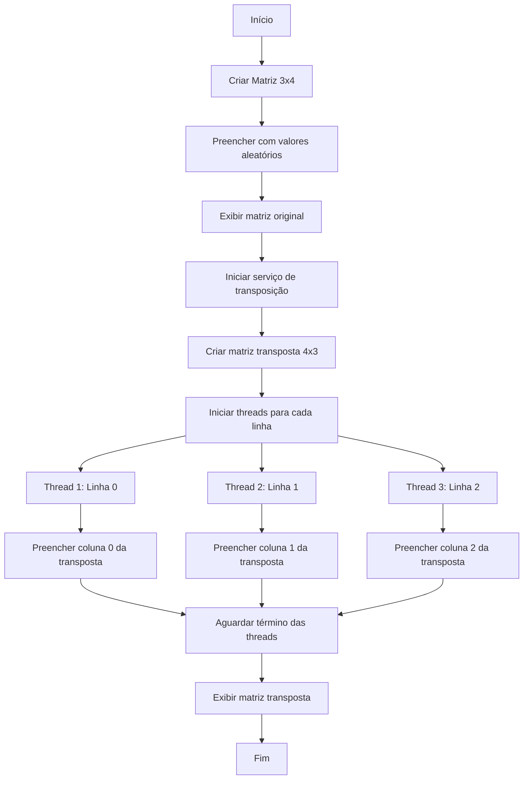

# 🧵 Transposição Paralela de Matriz com Threads em Java ⚡️

**Transposição Paralela de Matriz com Threads em Java** é um projeto que demonstra o poder da computação paralela aplicada à transposição de matrizes. Utilizando múltiplas threads para processar diferentes linhas de uma matriz simultaneamente, este projeto oferece uma solução eficiente para a transposição de matrizes, mostrando na prática os benefícios da programação concorrente.

## 📌 Funcionalidades

- **Geração de matriz aleatória**

- Cria uma matriz 3x4 de números inteiros com valores aleatórios

- **Transposição paralela**

- Cada linha da matriz original é processada por uma thread independente

- Geração de uma nova matriz transposta 4x3

- **Visualização clara**

- Impressão da matriz original e da matriz transposta

- Formatação tabular para fácil leitura

## ⚙️ Arquitetura e Boas Práticas

Este projeto segue princípios modernos de desenvolvimento de software, visando qualidade e eficiência:

### 🧱 Padrões de Projeto

- **Separação de Responsabilidades**

- Divisão clara entre geração de dados, processamento paralelo e exibição

- **Encapsulamento**

- A classe `Matriz` encapsula os dados e comportamentos relacionados à matriz

- As tarefas de transposição são encapsuladas na classe `MyRunnable`

- **Programação Orientada a Objetos**

- Uso da interface `Runnable` para tarefas paralelas

### ⚡️ Concorrência

- **Modelo de threads**

- Execução paralela de cada linha da matriz por threads independentes

- **Sincronização com `join()`**

- Coordenação das threads para aguardar a conclusão de todas antes de exibir o resultado

- **Tarefas independentes**

- Cada thread opera exclusivamente em sua linha, garantindo máxima eficiência e evitando condições de corrida

### 📐 Boas Práticas

- **Mensagens informativas de log**

- **Formatação de saída para melhor visualização**

- **Tratamento adequado de exceções** (InterruptedException)

## 🧪 Qualidade de Código

Para garantir robustez e eficiência, implementamos:

- **Validação implícita**

- Garantia de que cada thread acessa apenas posições válidas

- **Constantes Configuráveis**

- Flexibilidade para ajustar as dimensões da matriz (através do construtor)

- **Documentação Clara**

- Código autoexplicativo com comentários estratégicos

## 🧠 Conceitos Técnicos Aplicados

### ⚡️ Programação Concorrente

- Utilização de threads para processamento paralelo

- Implementação da interface `Runnable` para tarefas paralelizáveis

- Sincronização com `thread.join()` para coordenação de execução

### 📊 Matemática Computacional

- Transposição de matrizes (troca de linhas por colunas)

- Manipulação eficiente de matrizes bidimensionais

## ⚡️ Como Executar

```bash

# 1. Clone o repositório

git clone https://github.com/seu-usuario/matrix-transposer-parallel.git

# 2. Acesse o diretório

cd matrix-transposer-parallel

# 3. Compile os arquivos

javac Matriz.java MyRunnable.java MatrizTranspostaService.java Main.java

# 4. Execute o programa

java Main

```

## 📊 Exemplo de Saída

```plaintext

Matriz original (3x4):

23    45    12    67

89    34    56    10

5     78    42    91

Matriz transposta (4x3):

23    89    5

45    34    78

12    56    42

67    10    91

```

## 🏗️ Estrutura do Projeto

```

matrix-transposer-parallel/

├── src/

│   ├── Matriz.java

│   ├── MyRunnable.java

│   ├── MatrizTranspostaService.java

│   └── Main.java

├── LICENSE

└── README.md

```

### Arquitetura de Classes

| Classe | Responsabilidade |

|--------|------------------|

| `Matriz` | Gerencia dados da matriz (criação, preenchimento aleatório, impressão) |

| `MyRunnable` | Implementa a tarefa de transpor uma linha específica |

| `MatrizTranspostaService` | Orquestra a transposição paralela usando threads |

| `Main` | Ponto de entrada: cria matriz, inicia processo e exibe resultados |

## ⚙️ Detalhes de Implementação

### Matriz.java

```java

public class Matriz {

private final int linhas;

private final int colunas;

private final int[][] dados;

// Construtor que cria e preenche a matriz com valores aleatórios

public Matriz(int linhas, int colunas) {

this.linhas = linhas;

this.colunas = colunas;

this.dados = new int[linhas][colunas];

preencherAleatoriamente();

}

private void preencherAleatoriamente() {

for (int i = 0; i < linhas; i++) {

for (int j = 0; j < colunas; j++) {

dados[i][j] = (int) (Math.random() * 100);

}

}

}

// Getters e setters

// Método de impressão da matriz

}

```

### MyRunnable.java

```java

public class MyRunnable implements Runnable {

private final int linha;

private final Matriz origem;

private final Matriz destino;

public MyRunnable(int linha, Matriz origem, Matriz destino) {

this.linha = linha;

this.origem = origem;

this.destino = destino;

}

@Override

public void run() {

// Transpõe a linha designada para a coluna correspondente na matriz destino

for (int j = 0; j < origem.getColunas(); j++) {

int valor = origem.getValor(linha, j);

destino.setValor(j, linha, valor);

}

}

}

```

### MatrizTranspostaService.java

```java

public class MatrizTranspostaService {

public Matriz transporParalelamente(Matriz original) {

// Cria matriz transposta com dimensões invertidas

Matriz transposta = new Matriz(original.getColunas(), original.getLinhas());

// Cria e inicia uma thread para cada linha

Thread[] threads = new Thread[original.getLinhas()];

for (int i = 0; i < threads.length; i++) {

threads[i] = new Thread(new MyRunnable(i, original, transposta));

threads[i].start();

}

// Aguarda todas as threads terminarem

aguardarThreads(threads);

return transposta;

}

private void aguardarThreads(Thread[] threads) {

for (Thread thread : threads) {

try {

thread.join();

} catch (InterruptedException e) {

Thread.currentThread().interrupt();

System.out.println("Erro na execução das threads: " + e.getMessage());

}

}

}

}

```

### Main.java

```java

public class Main {

public static void main(String[] args) {

// Cria matriz original 3x4

Matriz matrizOriginal = new Matriz(3, 4);

System.out.println("Matriz original:");

matrizOriginal.imprimir();

// Realiza transposição paralela

MatrizTranspostaService transpositor = new MatrizTranspostaService();

Matriz matrizTransposta = transpositor.transporParalelamente(matrizOriginal);

// Exibe resultado

System.out.println("\nMatriz transposta:");

matrizTransposta.imprimir();

}

}

```

## ⚡️ Fluxo de Execução



## 📌 Características Técnicas

- **Orientação a Objetos**: Design modular com responsabilidades bem definidas

- **Paralelismo Eficiente**: Uso de threads para processamento concorrente

- **Segurança**: Cada thread acessa apenas posições exclusivas da matriz final

- **Tratamento de Exceções**: Interrupção de threads tratada adequadamente

- **Performance**: Redução do tempo de execução com processamento paralelo

## 🤝 Como Contribuir

1. Faça um fork do projeto

2. Crie sua feature branch (`git checkout -b feature/nova-feature`)

3. Commit suas mudanças (`git commit -m 'Adiciona nova feature'`)

4. Push para a branch (`git push origin feature/nova-feature`)

5. Abra um Pull Request

## 📄 Licença

Distribuído sob a licença MIT. Veja `LICENSE` para mais informações.

---
